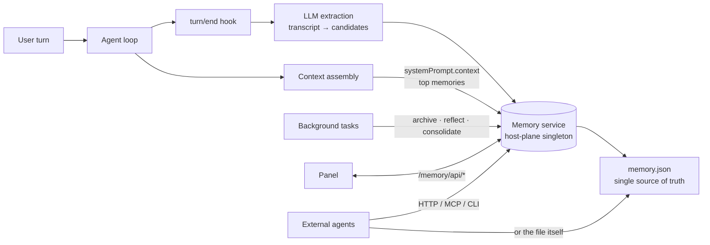

# dsh-memory

<p align="center">
  <strong>Long-term shared memory for the DeepSeek Harness.</strong><br>
  Cross-session · multi-agent · self-managing · with a visual panel
</p>

<p align="center">
  <strong>English</strong> | <a href="README.zh.md">中文</a>
</p>

<p align="center">
  
  
  
  
</p>

---

**dsh-memory** gives every session of the [DeepSeek Harness](https://github.com/deepseek-ai/deepseek-harness) a real long-term memory. It extracts, scores, stores, and recalls memories automatically; it shares them across sessions, subagents, and workflows; and it maintains itself — archiving what decays, distilling insights, consolidating noise — while you just keep working.

> **Why?** Every session starts with amnesia: your name, your preferences, last week's hard-won debugging lesson — gone. dsh-memory fixes that with one process-singleton memory service that every agent reads and writes, plus an LLM pipeline that mines your conversations in the background.

## ✨ Features

| | |
|---|---|
| 🧠 **Five memory types** | `semantic` · `episodic` · `procedural` · `preference` · `insight` |
| 🔄 **Cross-session sharing** | one host-plane singleton; sessions, subagents and workflow workers share one store |
| ⚙️ **Auto-extraction (LLM)** | every N turns, the session transcript is condensed into memory candidates with importance/confidence scores |
| 📉 **Forgetting curve** | `score = importance × confidence × 2^(−t/half-life)` — stale memories decay naturally |
| 🔍 **Fusion recall** | score × character n-gram semantic similarity (TF-IDF cosine) × entity co-occurrence graph |
| 🕸️ **Entity graph** | paths, identifiers, versions, quoted phrases and frequent CJK terms become nodes; co-occurrence becomes edges |
| 🧹 **Self-maintenance** | decayed memories auto-archive; LLM reflection distills insights; consolidation folds entity clusters into single facts |
| 🗄️ **Own-your-storage** | self-owned file backend — point `storage.root` at any folder (an Obsidian vault included); one human-readable JSON file is the single source of truth |
| 🤝 **External agents** | zero-dep CLI, documented file format, token-gated HTTP API, and a stdio MCP server for Claude Code & friends |
| 🎛️ **Visual panel** | timeline / relations / archive tabs with an interactive force-directed graph |
| 🪶 **Zero runtime deps** | plain ESM over the harness plugin protocol — no zod, no SDK, no native binaries |

## 🚀 Quick start

```jsonc
// ~/.dsh/profiles/web/package.json
{
  "dependencies": { "@zheexinn/dsh-memory": "link:<repo path>" },
  "dsh": { "profile": { "bundles": ["@zheexinn/dsh-memory"] } }
}
```

```bash
cd ~/.dsh/profiles/web && pnpm install   # then restart dsh web
```

That's it. Write one memory from the **记忆** panel (or let the model call `memory_remember`), then ask a new session *"what do you remember?"* — the model has `memory_recall`, and every turn ends with the top memories auto-injected into its runtime context.

## 🏗️ How it works



Three planes, one memory:

- **Hub row** (host plane) — the `memory` service singleton, the self-owned storage backend, the panel + remote APIs.
- **Agent row** (agent plane) — the four model tools, dynamic context recall, auto-extraction, and background maintenance. Mount it globally, or move it into an [agent preset](#preset-integration).
- **Client** — the panel tabs registered in the conversation ring and the plugins settings.

## 🧩 Memory lifecycle

1. **Capture** — on every Nth completed turn, the session log since the last watermark is rendered to a bounded transcript (newest lines kept).
2. **Extract** — an auxiliary LLM call (reusing the session's own `request/header` route) returns a JSON array of candidates with `type / content / importance / confidence / scope`.
3. **Gate** — `confidence < minConfidence` is dropped; `< verifyConfidence` lands as `unverified` (halved retrieval score, dashed in the panel).
4. **Merge** — same `content + scope` merges into the existing entry instead of duplicating, raising its importance.
5. **Store** — the record lands in `memory.json` (atomic tmp+rename rewrite).
6. **Recall** — ranking fuses the forgetting-curve score with n-gram cosine similarity and entity-graph weight; the top entries are injected into every session's runtime context.
7. **Maintain** — decayed entries auto-archive (hidden, recoverable); reflection distills insights; consolidation folds episodic clusters into semantic facts.
8. **Visualize** — timeline with provenance and access counts; entity cards with explained relations; an interactive graph.

## ⚙️ Configuration

```yaml
# profile cordis.patch.yml
- id: memory-hub
  name: '@zheexinn/dsh-memory'
  config:
    storage:
      root: 'D:/_Tools/Obsidian/memory'   # default: ${DSH_HOME|~/.dsh}/storages
    recallTopK: 5
    recallBudget: 1500
    importanceLearningRate: 0.01
    semanticWeight: 0.6
    graphWeight: 0.4
    archiveThreshold: 0.05
    server:                                # remote API (off by default)
      enabled: true
      token: 'a-long-random-token'

- id: memory-agent
  name: '@zheexinn/dsh-memory/agent'
  config:
    recallTopK: 5
    recallBudget: 1200
    extraction:
      enabled: true
      everyNTurns: 1          # >1 batches several turns per extraction
      maxInputChars: 6000
      minTranscriptChars: 40  # skip trivial turns
      minConfidence: 0.3
      verifyConfidence: 0.6
      maxCandidates: 8
      timeoutMs: 60000
      maxTokens: 1024
    archiveEveryNTurns: 10      # 0 disables
    reflectEveryNTurns: 10      # 0 disables
    consolidateEveryNTurns: 20  # 0 disables
    # Optional fixed route for background LLM calls; by default the session's
    # own request/header route is reused:
    # provider: deepseek
    # model: deepseek-chat
```

Full reference: every knob is a code default, so the plugin runs with zero configuration.

## 🗄️ Storage: own your memory

The hub registers its own file backend on the harness storage hub. The entire memory store is **one human-readable JSON file**:

```
{storage.root}/memory.json        # { unit, global, tables.entries }
```

- The default root is the harness storages dir, so existing data keeps working.
- Point `storage.root` at **any folder** — an Obsidian vault included: the file becomes a visible, searchable, version-controllable part of your notes. Move an existing store by copying `memory.json` over.
- Other harness domains are untouched — only `memory` relocates.
- The on-disk format is documented ([docs/external-format.md](docs/external-format.md)) and stable: external agents can read it directly, and the bundled CLI writes it with the exact plugin semantics (dedup merge, soft delete, atomic writes with optimistic concurrency).

```bash
npm run memory-cli -- list --scope user      # recall / remember / forget / restore / stats / export
```

## 🌐 Remote access & MCP

Enable the token-gated remote API (`server.enabled` + `server.token`) and any external agent can read and write memories over HTTP:

| Endpoint | Purpose |
| --- | --- |
| `GET /memory/remote/stats` | stats |
| `GET /memory/remote/list` | list |
| `GET /memory/remote/recall?query=&scope=&top_k=` | fusion recall |
| `POST /memory/remote/remember` | write |
| `POST /memory/remote/forget` | soft delete |
| `GET /memory/remote/export` | full export |

The bundled **zero-dependency MCP server** bridges those endpoints to any MCP client:

```jsonc
{
  "mcpServers": {
    "@zheexinn/dsh-memory": {
      "command": "node",
      "args": [
        "<repo>/scripts/mcp-server.mjs",
        "--api", "http://127.0.0.1:3080/memory/remote",
        "--token", "a-long-random-token"
      ]
    }
  }
}
```

Claude Code and friends get `memory_remember` / `memory_recall` / `memory_forget` / `memory_reflect` as first-class tools.

## 🧪 Pluggable embeddings

The default semantic layer is a dependency-free character n-gram index (CJK bigrams + whole-token extraction for paths/identifiers/versions). Any plugin can replace it without touching this package:

```js
ctx.provide('memoryEmbedding', {
  // contract: rank(texts, query) → scores[], same length as texts, 0..1
  rank: async (texts, query) => texts.map((text) => similarity(text, query)),
})
```

Failures fall back to the built-in n-gram index automatically.

## 🔌 Preset integration

The agent row mounts globally by default. To scope it to specific agent presets, remove the `memory-agent` row from the global patch and add it to the preset's `cordis.yml`:

```yaml
- id: memory-agent
  name: '@zheexinn/dsh-memory/agent'
  config: { recallTopK: 5, recallBudget: 1200 }
```

The `memory-hub` row must stay in the host composition — it is the process singleton.

## 🛠️ Development

```bash
npm test          # 6 behavior suites: pipeline / hub / external / vector / graph / mcp
npm run build     # client bundle (wire format)
npm run smoke     # node-half load check
```

## 🗺️ Roadmap

- Panel search box (keyword + semantic hybrid search UI)
- Reference embedding provider (local sentence-transformers bridge)
- Out-of-the-box cross-machine deployment guidance (service discovery, HTTPS)

## ❓ FAQ

**Does extraction cost extra LLM calls?** Yes — one auxiliary call per `everyNTurns` completed turns, reusing the session's own model route. Raise `everyNTurns`, or disable with `extraction.enabled: false` and keep using the tools manually.

**Is the remote API safe to expose?** It is off by default and Bearer-gated. Bind dsh to a trusted network and prefer HTTPS via a reverse proxy before exposing it beyond localhost.

**What happens to old memories?** Nothing is ever hard-deleted by the plugin. Memories decay → archive (hidden, restorable), and deletes are tombstones recoverable from the archive tab.

**Can I use sqlite instead?** The self-owned backend keeps a single JSON file by design (it is the external-agent format). A sqlite backend is a possible future variant; the format doc is the migration surface.

## 📄 License

[MIT](./LICENSE) © 2026 zhang66633 · Report security issues privately via GitHub security advisory.
