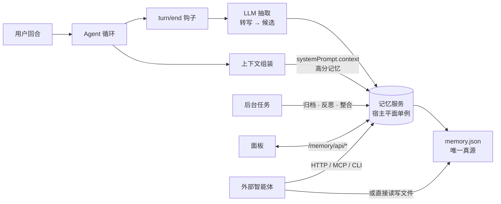

# dsh-memory

<p align="center">
  <strong>DeepSeek Harness 的长期共享记忆插件。</strong><br>
  跨会话 · 多智能体 · 自我维护 · 可视化面板
</p>

<p align="center">
  <a href="README.md">English</a> | <strong>中文</strong>
</p>

<p align="center">
  
  
  
  
</p>

---

**dsh-memory** 给 [DeepSeek Harness](https://github.com/deepseek-ai/deepseek-harness) 的每个会话装上真正的长期记忆：自动抽取、评分、存储、召回；跨会话/子代理/工作流共享；并自我维护——衰减的归档、洞察的反思、噪音的整合——你只管继续工作。

> **为什么？** 每个会话都从失忆开始：你的名字、你的偏好、上周踩过的坑——全忘了。dsh-memory 用一个宿主级单例记忆服务 + 后台 LLM 管线解决它。

## ✨ 特性

| | |
|---|---|
| 🧠 **五类记忆** | `semantic`（事实）· `episodic`（事件）· `procedural`（方法）· `preference`（偏好）· `insight`（洞察） |
| 🔄 **跨会话共享** | 一个宿主平面单例，多会话/子代理/工作流同读同写 |
| ⚙️ **LLM 自动抽取** | 每 N 回合把会话浓缩成带重要性/置信度的记忆候选 |
| 📉 **遗忘曲线** | `score = importance × confidence × 2^(−t/半衰期)`，旧记忆自然衰减 |
| 🔍 **融合召回** | 评分 × 字符 n-gram 语义相似（TF-IDF 余弦） × 实体共现图谱 |
| 🕸️ **实体图谱** | 路径/标识符/版本/引语/高频中文词成为节点，共现成为边 |
| 🧹 **自我维护** | 衰减自动归档；LLM 反思蒸馏洞察；整合把实体簇折叠成单条事实 |
| 🗄️ **存储自主** | 自管文件后端——`storage.root` 指向任意目录（Obsidian 库也行）；一个可读 JSON 文件即唯一真源 |
| 🤝 **外部智能体** | 零依赖 CLI、文档化文件格式、令牌门禁 HTTP API、stdio MCP 服务（Claude Code 等） |
| 🎛️ **可视化面板** | 时间线/关系/归档三页签 + 可交互力导向图 |
| 🪶 **零运行时依赖** | 纯 ESM + harness 插件协议——无 zod、无 SDK、无原生二进制 |

## 🚀 快速开始

```jsonc
// ~/.dsh/profiles/web/package.json
{
  "dependencies": { "@zheexinn/dsh-memory": "link:<仓库路径>" },
  "dsh": { "profile": { "bundles": ["@zheexinn/dsh-memory"] } }
}
```

```bash
cd ~/.dsh/profiles/web && pnpm install   # 然后重启 dsh web
```

就这些。在「记忆」面板写一条（或让模型调 `memory_remember`），然后开个新会话问「你还记得什么？」——模型有 `memory_recall`，且每回合结束时高分记忆自动注入其运行时上下文。

## 🏗️ 工作原理



三个平面，一份记忆：

- **Hub 行**（宿主平面）——`memory` 服务单例、自管存储后端、面板与远程 API；
- **Agent 行**（智能体平面）——四个模型工具、动态上下文召回、自动抽取、后台维护。默认全局挂载，也可移入 [agent preset](#preset-集成)；
- **Client**——注册在会话环与设置里的三页签面板。

## 🧩 记忆生命周期

1. **摄取**——每 N 个完成回合，水位线以来的会话日志渲染成受限转写（保留最新内容）；
2. **抽取**——一次辅助 LLM 调用（复用会话自己的 `request/header` 路由）返回候选数组（类型/内容/重要性/置信度/范围）；
3. **门槛**——低于 `minConfidence` 丢弃；低于 `verifyConfidence` 打「待验证」（检索分数折半、面板虚线显示）；
4. **合并**——同「内容+范围」合并进已有条目而非重复，抬升重要性；
5. **存储**——记录写入 `memory.json`（临时文件 + rename 原子重写）；
6. **召回**——遗忘曲线评分 × n-gram 余弦 × 图谱加权融合排序，高分条目注入每个会话的运行时上下文；
7. **维护**——衰减条目自动归档（隐藏不删、可恢复）；反思蒸馏洞察；整合把事件簇折叠成事实；
8. **可视化**——时间线含来源与引用次数；实体卡片说明每个关系的含义；可交互图谱。

## ⚙️ 配置

```yaml
# profile cordis.patch.yml
- id: memory-hub
  name: '@zheexinn/dsh-memory'
  config:
    storage:
      root: 'D:/_Tools/Obsidian/memory'   # 默认 ${DSH_HOME|~/.dsh}/storages
    recallTopK: 5
    recallBudget: 1500
    importanceLearningRate: 0.01
    semanticWeight: 0.6
    graphWeight: 0.4
    archiveThreshold: 0.05
    server:                                # 远程 API（默认关闭）
      enabled: true
      token: '足够长的随机串'

- id: memory-agent
  name: '@zheexinn/dsh-memory/agent'
  config:
    recallTopK: 5
    recallBudget: 1200
    extraction:
      enabled: true
      everyNTurns: 1          # >1 即攒批：多个回合合并抽取
      maxInputChars: 6000
      minTranscriptChars: 40  # 琐碎回合直接跳过
      minConfidence: 0.3
      verifyConfidence: 0.6
      maxCandidates: 8
      timeoutMs: 60000
      maxTokens: 1024
    archiveEveryNTurns: 10      # 0 关闭
    reflectEveryNTurns: 10      # 0 关闭
    consolidateEveryNTurns: 20  # 0 关闭
    # 后台 LLM 调用的固定路由（缺省复用会话 request/header 路由）：
    # provider: deepseek
    # model: deepseek-chat
```

每个旋钮都有代码默认值——零配置即可运行。

## 🗄️ 存储：记忆归你所有

Hub 在 harness 存储中枢上注册**自己的文件后端**。整个记忆库就是**一个人类可读的 JSON 文件**：

```
{storage.root}/memory.json        # { unit, global, tables.entries }
```

- 默认根目录是 harness 的 storages 目录，现有数据无缝继续；
- `storage.root` 指向**任意目录**——包括 Obsidian 库：文件成为笔记库中可见、可搜索、可版本化的一部分；迁移现有库只需把 `memory.json` 拷过去；
- harness 其他域不受影响——只有 `memory` 搬家；
- 落盘格式已文档化（[docs/external-format.md](docs/external-format.md)）且稳定：外部智能体可直接读取，自带 CLI 以与插件完全相同的语义写入（去重合并、软删除、原子写 + 乐观并发保护）。

```bash
npm run memory-cli -- list --scope user      # recall / remember / forget / restore / stats / export
```

## 🌐 远程访问与 MCP

开启令牌门禁的远程 API（`server.enabled` + `server.token`），任何外部智能体都能通过 HTTP 读写记忆：

| 端点 | 用途 |
| --- | --- |
| `GET /memory/remote/stats` | 统计 |
| `GET /memory/remote/list` | 列表 |
| `GET /memory/remote/recall?query=&scope=&top_k=` | 融合召回 |
| `POST /memory/remote/remember` | 写入 |
| `POST /memory/remote/forget` | 软删除 |
| `GET /memory/remote/export` | 全量导出 |

自带的**零依赖 MCP 服务**把这些端点桥接给任何 MCP 客户端：

```jsonc
{
  "mcpServers": {
    "@zheexinn/dsh-memory": {
      "command": "node",
      "args": [
        "<仓库路径>/scripts/mcp-server.mjs",
        "--api", "http://127.0.0.1:3080/memory/remote",
        "--token", "足够长的随机串"
      ]
    }
  }
}
```

Claude Code 等即可获得一等公民工具：`memory_remember` / `memory_recall` / `memory_forget` / `memory_reflect`。

## 🧪 可插拔 embedding

默认语义层是零依赖字符 n-gram 索引（中文 bigram + 路径/标识符/版本整词）。任何插件都能在不改本包的情况下替换它：

```js
ctx.provide('memoryEmbedding', {
  // 契约：rank(texts, query) → scores[]（与 texts 等长，0..1）
  rank: async (texts, query) => texts.map((text) => similarity(text, query)),
})
```

失败自动回退内置 n-gram 索引。

## 🔌 Preset 集成

agent 行默认全局挂载。要限定到特定 agent preset：从全局补丁移除 `memory-agent` 行，加进 preset 的 `cordis.yml`：

```yaml
- id: memory-agent
  name: '@zheexinn/dsh-memory/agent'
  config: { recallTopK: 5, recallBudget: 1200 }
```

`memory-hub` 行必须留在宿主组合——它是进程单例。

## 🛠️ 开发

```bash
npm test          # 六组行为测试：pipeline / hub / external / vector / graph / mcp
npm run build     # 客户端打包（wire 格式）
npm run smoke     # node 半边加载检查
```

## 🗺️ 路线图

- 面板检索框（关键词 + 语义混合搜索 UI）
- 参考 embedding provider（本地 sentence-transformers 桥）
- 跨机部署开箱指引（服务发现、HTTPS）

## ❓ FAQ

**自动抽取会多花 LLM 调用吗？** 会——每 `everyNTurns` 个完成回合一次辅助调用，复用会话自己的模型路由。调大 `everyNTurns`，或 `extraction.enabled: false` 只用工具手动写。

**远程 API 暴露安全吗？** 默认关闭且 Bearer 门禁。仅本机使用最安全；跨机请经反向代理走 HTTPS 并保管 token。

**旧记忆会怎样？** 插件从不硬删除任何东西：记忆衰减 → 归档（隐藏、可恢复），删除都是墓碑，可在归档页恢复。

**能用 sqlite 吗？** 自管后端刻意保持单 JSON 文件（它就是外部智能体格式）。sqlite 后端是可能的未来变体，格式文档即迁移面。

## 📄 License

[MIT](./LICENSE) © 2026 zhang66633 · 安全问题请通过 GitHub security advisory 私下报告。
