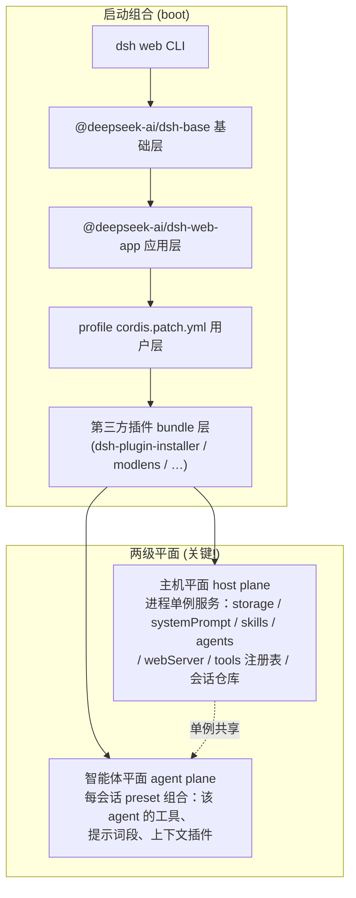
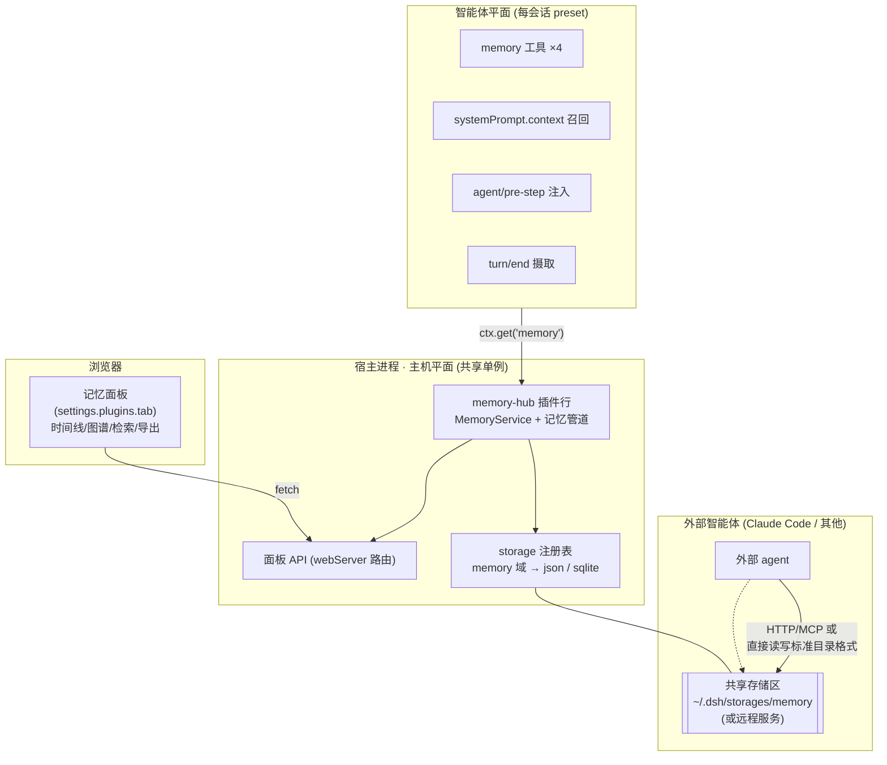

# DeepSeek Harness 架构 · 记忆插件视角（源码级）

> 依据 `D:\_Projects\deepseek-harness` 源码（packages/core、context、storage、system-prompt、bundle/web-app、client）整理。
> 目的：看清 harness 的扩展点，决定「记忆插件」在 DSH 里应该长成什么形态。

## 1. 组合层：一切皆插件行（cordis rows）



**记忆插件的结论 1**：共享记忆服务必须落在**主机平面**（进程单例，像 goals/tasks/subagent 注册表一样被所有会话看到）；模型可见的工具与注入属于**智能体平面**（随 preset 挂载）。

## 2. 会话与请求管线：记忆插件的四个挂点

```mermaid
graph LR
  A["用户输入"] --> B["agent/pre-step 瀑布<br/>(agent, messages, step, signal)"]
  B --> C["system-prompt 组装<br/>sections + contexts(动态快照) + tools + variables"]
  C --> D["LLM 请求"]
  D --> E["工具执行 tools/result"]
  E --> F{"step/end ?"}
  F -- 否 --> B
  F -- 是 --> G["turn/end"]
  G --> H["下一轮 / 会话结束"]

  B -.挂点①: 检索注入<br/>把相关记忆折进 messages<br/>(agent-instructions 同款).-> X1[记忆插件]
  C -.挂点②: 动态上下文<br/>context provider 每轮<br/>求值当前会话相关记忆.-> X1
  E -.挂点③: 观察工具结果<br/>(可触发"刚学到的经验").-> X1
  G -.挂点④: 摄取写回<br/>回合结束抽取+评分+入库.-> X1
```

**记忆插件的结论 2**：
- 挂点①（`agent/pre-step`）＝ 检索注入，同 `agent-instructions`（源码 `packages/context/agent-instructions/src/index.ts`）与 modlens autoRead 的模式；可走 `agent.inbox` 持久基线消息（带 identity 的 durable context）。
- 挂点②（`systemPrompt.context`）＝ 轻量每轮召回，进入「Current runtime context…supersedes…」动态快照。
- 挂点④（`session/event` 的 `turn/end`）＝ 回合级摄取。

## 3. 关键服务面（记忆插件能直接复用的原生设施）

| 设施 | 源码 | 记忆插件的用法 |
|---|---|---|
| **存储 hub**：命名后端注册表 + 域路由 | `packages/storage/storage/`（registry/backend） | **「可自选储存区」原生就有**：注册 `memory` 域，后端选 `json`（目录）或 `sqlite`（单文件），配置即切换 |
| systemPrompt 注册表 | `packages/core/system-prompt/src/index.ts` | `section/context/tools/variable` 四项注册 + `system-prompt/assemble` 专家瀑布 |
| 工具注册 | `packages/core/tools`（modlens 用裸 JSON-schema 注册） | `memory_remember/recall/forget/reflect` |
| 会话日志 | `packages/session`（事件流，step/turn 边界，可回放） | 摄取钩子 + 「注入过哪些记忆」可追溯记录 |
| webServer 路由 | `dsh-host-webserver`（modlens /plugin-store 同款） | 面板数据 API |
| API 网关 Remote | `dsh-host-apiproxy`（goals 域同款） | 面板 API 的另一种挂法（浏览器 RPC） |
| 设置 | `ctx.settingsScope` | 插件配置持久化 |
| 客户端槽位 | `settings.plugins.tab` / 会话视图环 | 可视化面板 |

**记忆插件的结论 3**：储存区自选**不要自己造**——直接注册进 DSH 的 storage 后端注册表（json/sqlite 已内建），配置项只是「memory 域路由到哪个后端」。语义向量检索（sqlite-vec）才是需要插件自己补的后端/索引。

## 4. 记忆插件形态：三平面 + 一条外部通道



- **单机多 dsh 会话**：所有会话经主机平面单例读写同一 `memory` 域 → 天然共享；
- **外部智能体**：两条路——(a) json 后端 = 定义清晰、可被外部工具直接读写的目录格式（Honcho 式「一个目录，多个 agent」）；(b) P3 加 HTTP/MCP 服务模式，dsh 插件变客户端（Hindsight 式）。

## 5. 一个现成模板：agent-instructions 就是「记忆注入」的教科书

`packages/context/agent-instructions` 完整示范了：durable 基线上下文（inbox + identity 重配）、`agent/pre-step` 折叠注入、`session/event` 生命周期钩子、工具触碰触发的增量投影。**记忆插件的 P0 实现应 1:1 参照它的结构**，把「读 AGENTS.md」换成「查记忆存储」。

## 6. 形态结论（最终选型）

| 决策 | 选型 | 依据 |
|---|---|---|
| 存储 | 复用 DSH storage 域（json/sqlite），另留 remote-http | 原生设施，少写代码 |
| 共享 | 主机平面单例 MemoryService | preset 架构的 host/agent 平面规则 |
| 注入 | 挂点① agent/pre-step + 挂点② systemPrompt.context | 两条现成缝，预算不同 |
| 摄取 | 挂点④ turn/end + session/event | 回合边界清晰、可回放 |
| 可视化 | settings.plugins.tab 面板 | 与 ui-settings-plugins 卡形态一致 |
| 外部共享 | json 目录格式（P0）→ HTTP/MCP 服务（P3） | 先本地后网络 |
