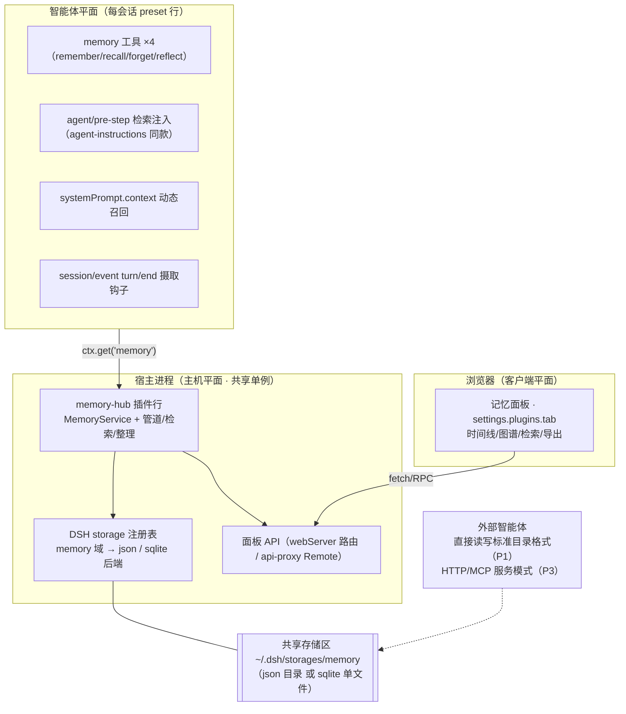

# dsh-memory — DeepSeek Harness 高级共享记忆插件 · 完整可执行方案

> 版本：v1.0 草案 · 日期：2026-08-15 · 状态：待评审
> 目标：一个「可自选储存区、跨会话/多智能体共享、先进记忆机制、可视化」的 DSH 原生插件。

---

## 1. 调研摘要：六种先进记忆机制的取舍

| 系统 | 核心机制 | 值得借鉴 | 不采用 |
|---|---|---|---|
| **Hindsight**（vectorize-io，ACL 2026，MCP 记忆服务器） | **Retain / Recall / Reflect** 三段：摄取时打分、检索时相关性排序、定期反思生成洞察 | 反思循环（reflect）、结构化记忆、MCP 化接口 | 平台绑定、服务化部署 |
| **Honcho**（plastic-labs，个人 AI 平台） | **deriver 管道**：原始消息 → 抽取 → 「thoughts」，按 user 维度共享，跨会话/跨应用 | 单一共享身份（user-scope）、管道化抽取、API 化 | 云端平台 |
| **Mem0**（记忆层 SDK） | 两段召回：**向量检索 + 图谱检索**再融合；写时去重更新（add→update）；重要性打分 | 双路召回、写时去重/更新、importance 字段 | 闭源平台部分、重 SDK |
| **Letta / MemGPT** | **自编辑记忆**：core/archival/recall 三块记忆 + **记忆压力**；agent 用工具改自己的记忆 | 记忆分层、记忆压力触发的自动整理、模型可写自己的记忆 | OS 隐喻过重 |
| **Zep / Graphiti** | **时序知识图谱**：实体+关系带时间有效性（双时态），边会过期 | 图谱化事实、时间有效性、边过期 | 部署重（需要 LLM 抽取管线） |
| **LangMem** | 记忆分四类（semantic/episodic/procedural/declarative）+ **consolidation 原语**；热路径与后台分离 | 记忆类型学、后台 consolidation、热/冷路径分离 | LangChain 绑定 |
| **instinct**（社区，置信度自学习） | 每次学到的「经验」带**置信度**，低置信度触发自我怀疑与验证 | 置信度门、经验验证闭环 | 实现粗糙 |

**设计决定**：以上机制**全部可落地为一个本地优先的 DSH 插件**，分层组合：

```
摄取(capture) ──> 抽取(extract, LLM) ──> 评分(score: importance×confidence×recency)
      ──> 去重/合并(merge) ──> 存储(backend) ──> 检索(recall: 精确+语义+图谱+衰减)
      ──> 注入(context assembly)          ──> 整理(consolidate/reflect/archive)
                                              └──> 可视化(visualize)
```

## 2. 现状盘点（DSH 已有 vs 缺失）

**已有**：
- `~/.dsh/memories/`：`daily/<日期>.md`（一行一条 `[HH:MM] [branch] [workspace] 描述`）、`projects/<hash>/MEMORY.md + KEY.md`（按项目记忆与关键事实）、`SUGGESTIONS.jsonl`、`canvas/boards.json` —— 由外部插件维护，**格式朴素、无检索、无评分、无图谱**；
- 会话日志（`~/.dsh/sessions/*.jsonl.zstd`，完整可回放）；
- 生态内已有 4 个记忆插件：`dsh-memory-evolve`（五轨记忆+自我进化）、`mnemon`（跨 agent 共享+知识图谱+侧栏）、`dsh-auto-memory`（三层记忆+可视化面板）、PowerContext（HTTP 服务）。**但没有一个同时满足：存储可换 + 跨会话共享 + 先进机制 + 可视化四合一，且都不开源可审计或绑定外部服务**。

**缺失**（本插件要补的）：可插拔存储后端、评分/衰减/置信度、语义+图谱检索、反思与遗忘、记忆来源追踪、可视化面板。

## 3. 架构总览（三平面形态，源码级校正版）



**核心原则（按 harness 源码校正）**：
- 共享服务放**主机平面**（进程单例，像 goals/tasks/subagent 注册表）；模型可见工具与注入放**智能体平面**（preset 行）——这是 web 组合 `cordis.patch.yml` 的 host/agent 平面规则；
- 储存区自选**复用 DSH 原生 storage 服务**（`packages/storage`：命名后端注册表 + 域路由），不自造文件后端；
- 检索注入照抄 `packages/context/agent-instructions` 的 `agent/pre-step` + inbox 模式。


## 4. 需求一：可自选记忆储存区（复用 DSH storage）

```yaml
# 组合树里 memory-hub 行配置（主机平面）
- id: memory-hub
  name: 'dsh-memory/hub'
  config:
    storage:
      backend: json          # json | sqlite（DSH 内建后端）
      path: ~/.dsh/storages/memory   # json=目录；sqlite=单文件；默认 dshHomePath('storages') 下 memory 域
    remote:                  # 仅外部共享 P3 需要
      url: http://127.0.0.1:7777
      tokenEnv: MEMORY_TOKEN
```

| 后端 | 来源 | 能力 | 适用 |
|---|---|---|---|
| `json`（默认） | DSH `dsh-storage-json` | 原子写、git 可版本化、**外部 agent 可直接读写** | 单机、跨工具共享、想直接看文件 |
| `sqlite` | DSH `dsh-storage-sqlite` | 事务、WAL、多进程同库 | 单机多 profile/多进程高频读写 |
| `sqlite-vec`（P2 自研后端） | 插件注册进 storage 注册表 | 上述 + 本地向量检索 | 语义检索不想起服务 |
| `remote-http`（P3） | 插件自建客户端 | HTTP/MCP 服务 | 多机、跨设备、组织共享 |

- 记忆插件只注册一个 `memory` **域**到 `ctx.storage`（`dsh-storage-domain` 的 route 表），后端切换就是配置一行——**「储存区可自选」由 DSH 原生机制保证**；
- 域内数据结构（记忆条目 schema）是插件自己的格式：json 后端一个文件一条记忆 + `index.jsonl`，外部 agent 有文档可循（Honcho 式「一个目录，多个 agent」）；
- 迁移/导出：设置页「导出/导入」按钮（JSON 全量转储）+ `migrate` 子命令（域内后端互迁）。

## 5. 需求二：跨会话、多智能体共享

**记忆身份（Memory Identity）三轴**：

```
user:lenovo × workspace:D:\_Projects × project:dsh-pixel-ui
```

- `user` 轴：全局共享（偏好、跨项目经验）——对应 Honcho 的 user-scope；
- `workspace` 轴：同一工作目录下所有会话共享；
- `project` 轴：更细粒度（可选）。
- 检索按「命中范围从窄到宽」融合：project → workspace → user。

**多智能体共享**：
- **dsh 内部**（多会话 + 子代理 + workflow worker + 多 profile）：全部经主机平面单例 MemoryService 读写同一 `memory` 域，天然一致（进程内单例；跨进程靠 sqlite WAL 或 json 原子写）；
- **外部智能体**（Claude Code 等）两条路：
  - P1：`json` 后端 = 明确定义的目录格式（`index.jsonl` + 每条一个 JSON），外部 agent 用自带工具/插件读写，Honcho 式共享；
  - P3：HTTP/MCP 服务模式（Hindsight 式）——本插件加一个可选的轻量服务器（或复用 dsh 自身 webServer 暴露 `/memory/mcp`），dsh 与外部分别作客户端；
- 每条记忆记录**来源**（`source: {agent, session, workspace, at}`）并可选**写入权限位**（`private` 仅本会话可见 / `project` / `user`）；
- 冲突策略：写时去重（新记忆与已有记忆语义比较 → 相同则 update 并抬升 importance，不同则新增），无锁冲突由后端原子性兜底。

## 6. 需求三：先进记忆机制（完整清单）

**6.1 记忆类型学**（LangMem 四类 + 偏好）

| 类型 | 例 | 生存期 |
|---|---|---|
| `semantic` 事实 | 「用户的 npm 账号是 zheexinn」 | 长 |
| `episodic` 事件 | 「08-15 修了商店 BOM 坑」 | 中，可衰减 |
| `procedural` 方法 | 「Windows 下写 JSON 别用 Set-Content -Encoding UTF8」 | 长 |
| `preference` 偏好 | 「回复要口语化」 | 长 |
| `insight` 洞察 | 反思产物 | 长 |

**6.2 摄取与抽取**（Honcho deriver 模式）

- 钩子：`ctx.on('session/event', …)` 监听 `turn/end`（与 `agent-instructions` 监听 `step/start`、`step/end`、`turn/end` 同款生命周期缝），回合结束后异步抽取（不改主循环，不阻塞模型）；
- 抽取：调用**本机已配置的 LLM**（`ctx.llm`，或复用 dsh 当前 provider）把回合浓缩成 0..n 条记忆候选（结构化 JSON：type/content/entities/confidence/importance/expires）；
- 阈值：`confidence < 0.6` 的记忆打 `unverified` 标记（instinct 模式）——检索时降权并显示「待验证」。

**6.3 评分与衰减**

```
score = importance × confidence × recency(t)
recency(t) = 2 ^ (−t / half_life_days)      # Ebbinghaus 遗忘曲线
```

- `importance` 由抽取 LLM 给 0..1，事后被「被检索命中次数」缓慢抬升（用进废退）；
- 每条记忆带 `last_accessed_at`，注入和人工确认都会刷新 recency。

**6.4 检索（Mem0 双路 + Zep 图谱）**

1. 精确路：关键词 / 标签 / 时间窗 / scope 过滤；
2. 语义路：query embedding 近邻（sqlite-vec 后端）；
3. 图谱路：实体-关系共现（轻量本地图谱，无需完整 Graphiti）：`实体A—关系→实体B` 带时间有效性，过期边不召回；
4. 融合排序：`final = a·score + b·semantic_sim + c·graph_boost`，top-k 后按**上下文预算**（字符数上限）截断。

**6.5 记忆压力、整理与遗忘**（Letta 模式）

- 后台任务（DSH 定时/回合计数触发）：`consolidate`（把同一实体的多条 episodic 合并成一条 semantic）、`archive`（衰减到阈值以下移入归档，不删除）、`reflect`（回顾近 N 天，生成 insight，Hindsight 模式）；
- 模型可通过 `memory_forget` 主动删除错误记忆；删除是软删除（tombstone），可视化面板可恢复。

**6.6 上下文注入（两条原生缝，双保险）**

- **缝①`agent/pre-step` 折叠注入**（`agent-instructions` 同款）：会话/工作区切换时组装 `KEY 级记忆`（恒在，≤500 字）＋ `按当前任务检索的相关记忆`（≤1500 字），作为 `source.kind='memory'` 的用户消息折进 messages；可走 `agent.inbox` 做成带 identity 的持久基线（重配/替换语义现成）；
- **缝②`systemPrompt.context` 动态快照**：注册一个 context provider，每次组装时求值「当前会话的 top 相关记忆」，进入「Current runtime context…supersedes…」快照——轻量、每轮刷新、不落会话日志正文；
- 两条缝由配置选择（`inject.mode: prestep | context | both`）；
- 注入记录「本次注入了哪几条」进会话日志（可回放、可追溯）。

## 7. 需求四：可视化（新增）

**A. 设置页「记忆」面板**（`settings.plugins.tab` 槽位，仿插件商店形态）：

```
┌─ 记忆面板 ──────────────────────────────┐
│ 统计行：127 条 · 事实34 · 事件41 · 方法22 │
│ [时间线] [图谱] [聚类] [检索]  ← 分页      │
│  时间线：按时间轴滚动，每条带类型色标、     │
│  来源 agent、置信度徽章、编辑/删除/确认     │
│  图谱：实体-关系力导向图（svg/d3，实体点击  │
│  展开相关记忆）                           │
│  聚类：按语义簇/tag 分组卡片               │
│  检索：关键词+语义混合搜索、命中高亮        │
│ [导出 JSON] [导入] [清空归档]             │
└──────────────────────────────────────────┘
```

**B. 会话内轻量可视化**：助手回答中可用 `dsh-ui` 围栏渲染「本轮注入了哪些记忆」（mermaid 图谱 / 列表），配合已装的 genui 渲染器。

**C. 可观测性**：每条记忆卡显示 `source`（哪个 agent、哪个会话、何时写的）与「被引用次数」——可视化回答「谁记住了什么、什么时候记住的」。

## 8. DSH 接口与骨架（可执行，源码对齐版）

**包结构（一个包，两个插件行 + 一个客户端半面）**：

```
dsh-memory/
├── package.json          # name dsh-memory；exports ./hub / ./agent / ./client / ./package.json
├── cordis.patch.yml      # - insert: - id: memory-hub  name: 'dsh-memory/hub'
│                         #            - id: memory-agent name: 'dsh-memory/agent'（进 preset 标准组合）
├── lib/hub.js            # 主机平面行：MemoryService + storage 域注册 + 面板 API
├── lib/agent.js          # 智能体平面行：4 工具 + pre-step 注入 + systemPrompt.context + turn/end 摄取
├── lib/pipeline.js       # extract(LLM)→score→merge→store
├── lib/retrieve.js       # 四路融合排序 + 衰减
├── lib/vec-backend.js    # P2：sqlite-vec 注册进 ctx.storage 后端表
├── src/client/index.js   # 客户端半面：settings.plugins.tab 记忆面板（仿 StoreView）
├── scripts/build.mjs     # wire 格式打包（复制 dsh-plugin-installer 配方，external 含 ui-slots/runtime）
└── README.md             # 9 章节规范
```

**主机平面 hub（apply(ctx, config)）**：

```js
export const inject = ['storage', 'webServer', 'llm']   // 服务必须在主机平面（进程单例）
ctx.provide('memory', {
  remember(entry), recall(query, opts), forget(id, opts),
  reflect(since), consolidate(), list(opts), stats(), migrate(to),
})
ctx.storage // 注册 memory 域：config.storage.backend（json/sqlite）→ path
ctx.webServer.register({ path: '/memory/api/*', … })    // 面板数据接口
// 可选：ctx.api 的 Remote 域（面板走 apiproxy 的 goals 同款 RPC）
```

**智能体平面 agent（apply(ctx, config)）**：

```js
export const inject = ['memory', 'systemPrompt', 'llm', 'agents']
ctx.get('memory')                                        // 读主机单例（跨会话共享的关键）
ctx.tools.register(memoryTools)                          // remember/recall/forget/reflect
ctx.systemPrompt.context({ name:'memory:recall', order: 200,
  text: (ctx2) => renderTopMemories(sessionId(ctx2)) })  // 缝②
ctx.on('agent/pre-step', …)                              // 缝①（agent-instructions 同款）
ctx.on('session/event', …)                               // turn/end → 异步摄取
```

**模型工具（4 个）**：

| 工具 | 入参 | 出参 |
|---|---|---|
| `memory_remember` | content/type/importance/scope | 记忆 id + 去重结果（created/updated） |
| `memory_recall` | query/scope/topK | 命中列表（含 score、来源、置信度） |
| `memory_forget` | id 或 query | 软删确认 |
| `memory_reflect` | 时间窗 | 新 insight 列表 |

**注入 config 项**：`inject.mode`（prestep/context/both）· `inject.budgetChars` · `inject.scopes`。

## 9. 分阶段路线（可执行顺序）

| 阶段 | 内容 | 验收 |
|---|---|---|
| **P0（2-3 天）** | hub（json 域）+ agent 行（4 工具 + 手动记忆 + 缝①注入）+ 设置页面板（时间线+编辑+导出） | 两个会话共享一条记忆可召回 |
| **P1（+3 天）** | 自动抽取（LLM）+ 评分/衰减 + 写时去重 + sqlite 后端 + **外部 agent 目录格式文档** | 无手动干预自动积累；衰减生效；外部可读写 |
| **P2（+4 天）** | sqlite-vec 语义检索 + 轻量图谱 + consolidate/reflect/archive + 图谱可视化 | 语义召回 + 反思洞察 + 图谱可看 |
| **P3（+3 天）** | **HTTP/MCP 服务模式**（跨机/外部智能体共享）+ 多智能体来源追踪 + 权限位 + 迁移完善 | 两台机器共享；外部 agent 经 MCP 读写 |

每阶段独立可发布（npm `dsh-memory`）。

## 10. 风险与边界（诚实版）

1. **隐私**：记忆天然含敏感内容——默认本地存储、`private` 权限位、`memory_forget` 立即生效、面板一键清空；remote 后端文档必须大字提示。
2. **幻觉记忆**：LLM 抽取可能记错——置信度门 + `unverified` 标记 + 面板人工确认流。
3. **上下文膨胀**：注入预算硬上限；检索只在「需要时」触发（工具调用优先于自动注入）。
4. **与既有插件关系**：不迁移 `~/.dsh/memories`（那是别人的格式），默认用 `memories/v2` 目录；提供「导入 dsh-auto-memory / memory-evolve 导出」的迁移说明。
5. **抽取成本**：每次回合多一次 LLM 调用——`extraction.enabled` 可关，或降频（每 N 回合抽一次，攒批后台处理）。

## 11. 立即可执行的第一步

```bash
mkdir D:\_Projects\dsh-memory && cd D:\_Projects\dsh-memory
git init && npm init -y   # 按第 8 节骨架填 package.json（dsh.bundle.patch + dsh.client）
# P0 只需要：lib/backends/file.js + MemoryService + tools.js + inject.js + 面板最小版
# 客户端构建直接复制 dsh-plugin-installer 的 scripts/build.mjs（wire 格式已验证）
```

---

### 附：资料来源

- [Hindsight — Agent Memory That Learns（ACL 2026 demo）](https://aclanthology.org/2026.acl-demo.27/) · [开源仓库](https://github.com/vectorize-io/hindsight)
- [Honcho docs（deriver/thoughts）](https://docs.honcho.dev/v2/documentation/introduction/vibecoding)
- [Mem0 架构文档](https://github.com/mem0ai/mem0/blob/main/skills/mem0/references/architecture.md)
- [Letta / MemGPT 记忆概念](https://forum.letta.com/t/how-does-memory-work-in-letta/93)
- [Zep Graphiti 论文](https://arxiv.org/abs/2501.13956)
- [LangMem 概念指南](https://langchain-ai.github.io/langmem/concepts/conceptual_guide/)
- [instinct：基于置信度的自学习记忆系统](https://developer.aliyun.com/article/1724532)
